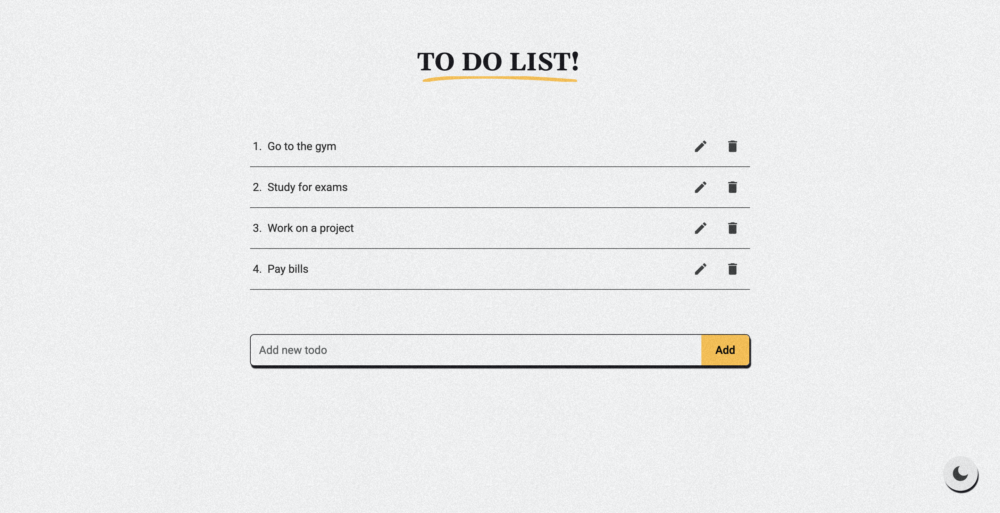

## Overview

This is a simple todo app with Vue, Typescript, Tailwindcss, and Pinia. it allows you to easily add, remove, and update your todo items to stay organized and productive. The site has a clean and intuitive interface, making it easy for users to stay organized and on top of their tasks.



## Installation

```bash
yarn install
```

## Usage

```bash
yarn dev
```

## Attention !!!

- Please enjoy and don't forget fork and give a star
- Don't Forget Follow My Github Account
